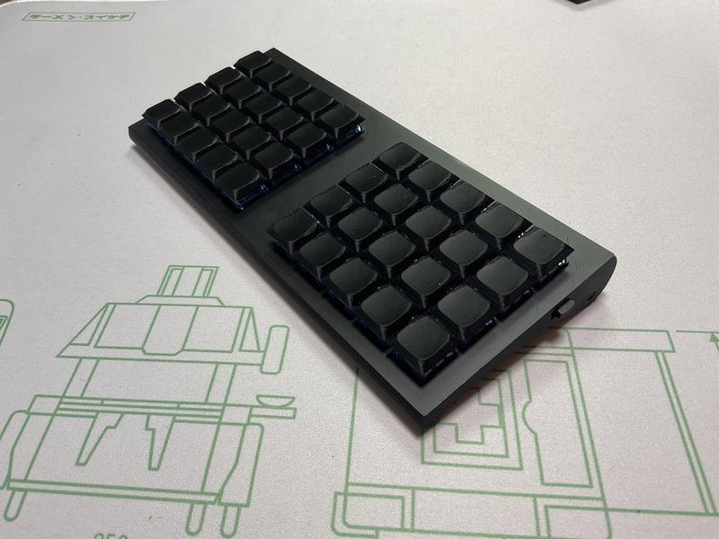

 　# Buildguide for cool640zmk
 

## 0 部品の確認
 
Follow the BOM on github's readme.md to make sure that all the parts are available.
 
githubのreadme.mdのBOMに沿って、部品が全て揃っているかを確認してください。
 

## 1 ダイオードのはんだ付け

If the diode is already soldered, please skip this operation.
 
すでにダイオードのはんだ付けされている場合は、この作業を省略してください。
 
 
This work is done on the left and right keyboard boards respectively.
 
この作業は左右のキーボード基板でそれぞれ行います。
  
Solder the diodes to the back of PCB.
 
PCBの裏面にダイオードのハンダ付けをします。
 
As expected, it is compatible with SMD type.
 
ダイオードは、SMDタイプに対応しています。
 
Diodes have polarity, so be careful about the direction in which they are installed.
 
ダイオードには極性がありますので、取り付ける向きに注意してください。
 

[ダイオード（SMD)のはんだ付けの動画](https://youtu.be/ODk16bd4XkA)
 
[ダイオード（リードタイプ）のはんだ付けの動画](https://youtu.be/lbAQkKzNawM)
 
[ダイオード（リードタイプ）のはんだ付けの動画２](https://youtu.be/3hWZjaBROL8)

 

## 2  スイッチソケットのハンダ付け

Cool640zmk supports choc switch sockets.
 
cool640zmkでは、chocのスイッチソケットに対応しています。
  
Solder the switch socket to the back of the keyboard board.
 
キーボード基板の裏面にスイッチソケットのハンダ付けをします。
 

[Switch socketハンダ付け動画](https://youtu.be/ZnbgaueMR4w?si=_JLjD--3HJJ5Pu7Q)

 

## 3 Seeed xiao bleのハンダ付け

<b>Note</b>
 
次の動画を参考にしてハンダ付けをしてください。
 
[xiao bleのハンダ付け動画](https://youtu.be/98yqLjzfdl4)

## 4  電池ボックス取り付け

Insert the battery box from the bottom of the board and temporarily fix it in place with masking tape. Then, cut off the leads sticking out from the top of the board with pliers or something similar, and solder them.
 
電池ボックスを基板の下面から、差し込み、マスキングテープで仮固定します。そして、基板の上面から飛び出したリードをニッパーなどで切り取り、ハンダ付けをしてください。
 

## 5 スライドスイッチのハンダ付け

Insert the switch from the underside of the PCB with the tab facing outwards.
 
スイッチのつまみが外側に向くようにして、PCBの下面から差し込みます。
 
Temporarily fix it in place with masking tape or something similar, then cut off the part sticking out on the top surface of the PCB with pliers, and then solder it.
 
マスキングテープなどで仮固定をしてから、PCBの上面に出た部分をニッパーで切り取ってから、はんだ付けします。
 

[スライドスイッチのはんだ付けの作業動画](https://youtu.be/5nkRklibay4)

 

## 6 リセットスイッチのハンダ付け

The switch button faces down and is inserted into the underside of the PCB.
 
スイッチのボタンが下に向くようにして、 PCBの下面から差し込みます。
 
Temporarily fix it in place with masking tape or something similar, then cut off the part sticking out on the top surface of the PCB with pliers, and then solder it.
 
マスキングテープなどで仮固定をしてから、PCBの上面に出た部分をニッパーで切り取ってから、はんだ付けします。

[リセットスイッチハンダ付け動画](https://youtu.be/Pl24Exfh8b8)

## 7　キースイッチの装着

Insert the key switch in the following order: top case, then PCB.
 
トップケース、PCBの順になるように、キースイッチを差し込んでください。
 
When inserting the key switch, make sure the pins are straight.
 
キースイッチを差し込む時、キースイッチのピンが真っ直ぐになっているか、確認してください。
 

## 8 動作確認について

ファームウェアの導入について、こちらの記事を参考にしてください。
 
[自作キーボードへのzmk_firmwareのインストールについて](https://sizu.me/m_ki/posts/kvixkn2mec6a)

 
Keymapの編集について、こちらの記事を参考にしてください。

[zmk_firmwareでのキーマップ編集について](https://sizu.me/m_ki/posts/m3devs7be5km)

## 9 ボトムケースの装着

動画を参考にしてください。

[ケースの開閉について](https://www.youtube.com/watch?v=Rq6qG2JvAKY)

##  10　キーキャップの装着

Please attach your favorite keycap.
 
お好きなキーキャップを装着してください。
 

## 11 完成

After attaching non-slip rubber to the bottom of the bottom case, it's done.
 
Please enjoy a life with a better keyboard.
 
ボトムケースの底面に、滑り止めゴムを取り付けたら、完成です。
 
よりよいキーボードのある生活を楽しんでください。
 

